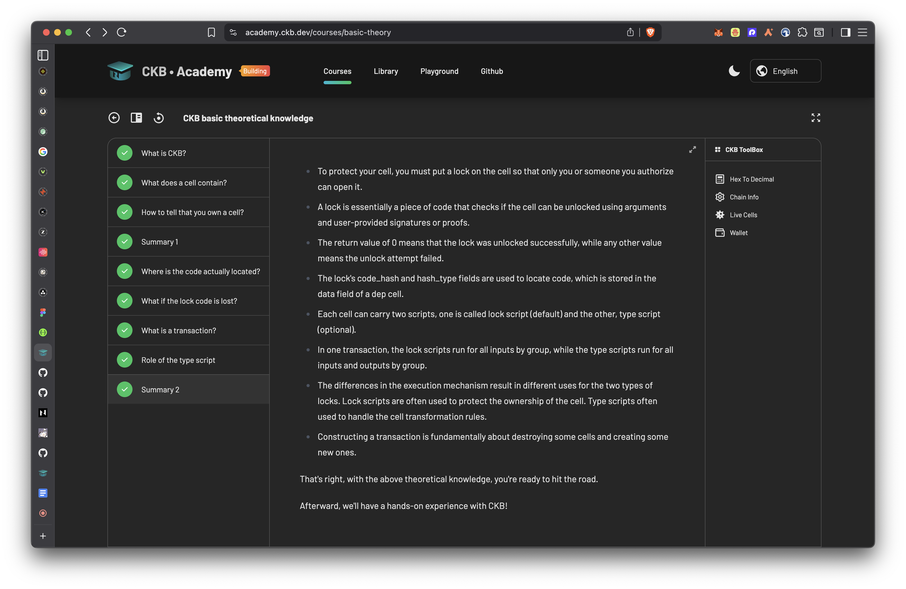
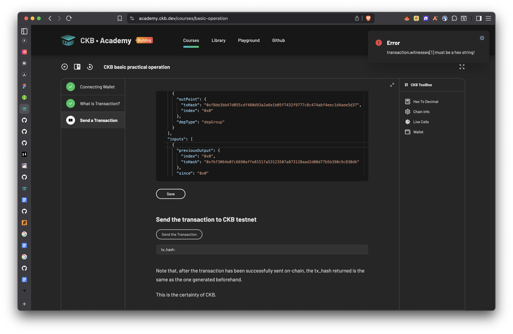

# Week 1 Report — CKBuilder Track

**Period:** March 23–29, 2026  
**Participant:** Truth  
**Track:** Builder

---

## Summary

First week of the CKBuilder program. Focus was on setting up the development environment and building foundational theoretical knowledge of CKB.

---

## Completed This Week

### Environment Setup
- Installed all required tooling
- Set up local dev environment using OffCKB
- Configured project structure

### Reading & Study
- [Introduction to Nervos CKB](https://docs.nervos.org/docs/tech-explanation/nervos-blockchain) — core technical concepts and terminology
- [Getting Started on CKB](https://docs.nervos.org/docs/getting-started/how-ckb-works) — how CKB works
- [Quick Start](https://docs.nervos.org/docs/getting-started/quick-start) — dev environment and project setup via OffCKB

### CKB Academy — Lesson 1: CKB Basic Theoretical Knowledge ✅
Topics covered:
- What is CKB?
- What does a cell contain?
- How to tell that you own a cell?
- Summary 1
- Where is the code actually located?
- What if the lock code is lost?
- What is a transaction?
- Role of the type script
- Summary 2

### CKB Academy — Lesson 2: CKB Basic Practical Operations 🔄 (In Progress)
Topics covered:
- Connecting Wallet
- What is a Transaction?
- Send a Transaction

Currently on the second-to-last step. Facing a blocker on the final submission step — to be resolved next week.

---

## Blockers

- **Academy Lesson 2 submission:** Unable to complete the final submission step. Currently investigating the issue and will follow up with the team if unresolved early next week.

---

## Plan for Week 2

- Resolve the Lesson 2 blocker and complete submission
- Continue with remaining CKB Academy modules
- Begin exploring the CCC Playground
- Start the Transfer CKB and Store Data on Cell tutorials
